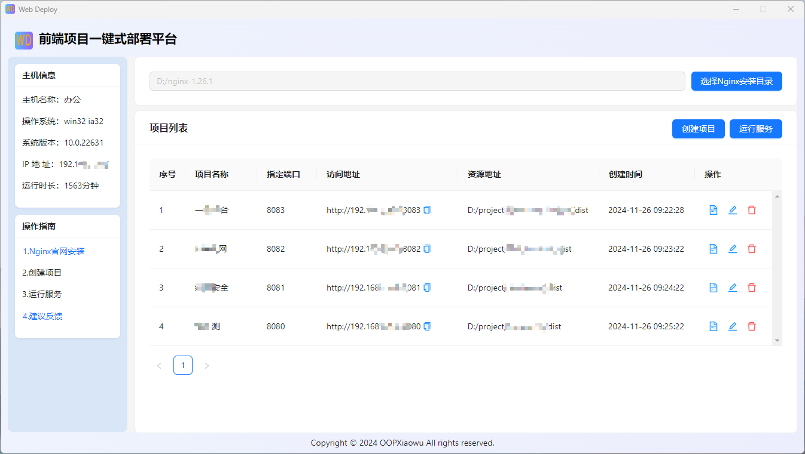

# 前端项目本地部署平台
## 项目简介
    这是一个使用Vite + Vue 3 + Node.js + Electron构建的前端项目本地部署平台。
    该平台旨在简化前端项目的本地开发与测试流程，通过集成最新的前端技术和工具链，为开发者提供高效、便捷的开发体验。无论是个人开发者还是团队协作，都能从中受益。
### 主要功能
##### 项目管理: 支持多个前端项目的管理和切换。
##### 环境配置: 可以轻松配置不同环境下的API地址和其他设置。
##### 实时预览: 实时预览前端项目的最新改动。
##### 一键构建: 一键构建项目并生成可执行文件。


## 技术栈

- **框架**: Vue 3 (`^3.4.37`)
- **UI库**: Ant Design Vue (`^4.2.5`)
- **打包工具**: Vite (`^5.4.1`)
- **桌面应用**: Electron (`^32.1.2`)
- **构建工具**: electron-builder (`^25.1.8`)

## 环境要求

确保您的开发环境满足以下要求：

- Node.js 版本 `20.10.0+`
- Yarn 安装完成

## 安装与配置

### 克隆项目

首先，克隆该项目到您的本地机器：

```bash
git clone https://gitee.com/oop_xiaowu/web-deploy.git
cd web-deploy
yarn install

启动开发服务
yarn dev:all

构建UI界面包
yarn build:vite

构建exe安装包 存放于build目录下
yarn build:exe


